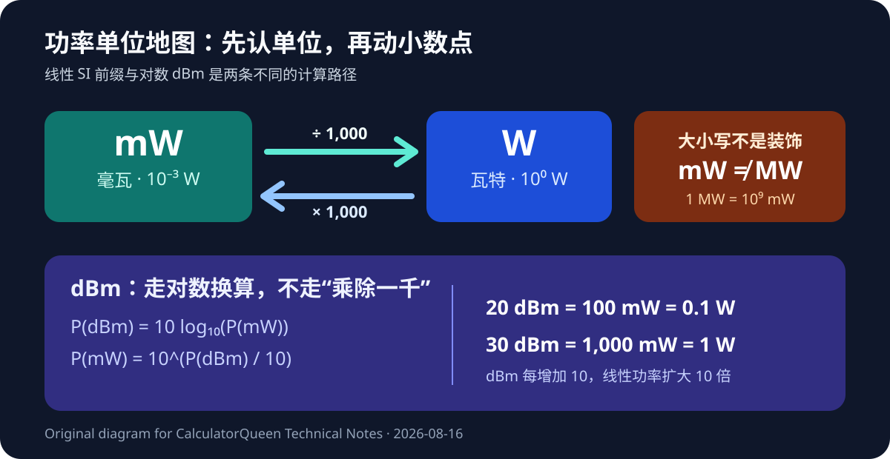

# 一个字母，差十亿倍：mW、W 与 dBm 的换算边界

先给结论：毫瓦换瓦特，除以 1,000；瓦特换毫瓦，乘以 1,000。只有这一件事时，计算并不难。

真正容易出错的是单位。`mW`、`MW` 和 `dBm` 看着像亲戚，实际上一个是小功率单位，一个是大功率单位，另一个干脆走对数路线。把小写 `m` 随手改成大写 `M`，结果会放大十亿倍。计算器没疯，键盘可能只是过于自信。

## 先把线性换算算清楚

国际单位制中的前缀“毫（milli）”表示 $10^{-3}$。因此：

$$
1\ \text{mW}=0.001\ \text{W}
$$

设 $P_{\text{mW}}$ 是以毫瓦表示的功率数值，$P_{\text{W}}$ 是以瓦特表示的同一功率数值，则：

$$
P_{\text{W}}=\frac{P_{\text{mW}}}{1000}
$$

反向换算是：

$$
P_{\text{mW}}=1000P_{\text{W}}
$$

例子很直接。250 mW 换成瓦特：

$$
250\div1000=0.25
$$

所以 250 mW = 0.25 W。若得到 250 W，不是设备突然性能暴涨，而是“毫”被漏掉了。

我也在自有的 [CalculatorQueen Milliwatt Calculator](https://calculatorqueen.com/calculators/milliwatt-calculator) 中输入 250 mW，页面返回 0.25 W，并明确显示公式 `watts = milliwatts × 0.001`。手算与页面结果一致。

## 多个器件相加，先别急着四舍五入

假设有 40 个相同模块，每个额定功率是 75 mW。先在原单位中合计：

$$
40\times75\ \text{mW}=3000\ \text{mW}
$$

再换单位：

$$
3000\ \text{mW}=3\ \text{W}
$$

这比把每个模块先写成 0.075 W、逐项显示并提前取整更容易审计。原则是：中间过程保留精度，最后展示时再按需要舍入。

换单位不会凭空提高测量精度。若原始规格只写到 75 mW，把它换成 0.075000 W 并没有多出三位可靠信息；那只是屏幕更勤快。记录结果时，应保留与原始数据和用途相称的有效位数，并把“单位换算得到的精确比例”与“传感器实际测得多准”分开。前者由定义决定，后者受仪器与环境限制；这比多显示几位小数更值得优先检查。

不过，“能相加”不代表“应该相加”。待机、典型、发射、启动和最大功率描述的是不同工作状态。40 个模块若不会同时处于峰值，直接把所有峰值相加可能过度估计；反过来，只拿待机值做电源预算又可能低估。单位转换只负责数值关系，不替你决定使用场景。

## 小写 m 和大写 M，差九个数量级

小写 `m` 是 milli，即 $10^{-3}$；大写 `M` 是 mega，即 $10^6$。二者相差 $10^9$：

$$
1\ \text{MW}=10^6\ \text{W}=10^9\ \text{mW}
$$

也就是说，1 MW 等于 10 亿 mW。单位符号区分大小写不是排版洁癖，而是数据的一部分。

书写时，数值和单位符号之间应留空格，例如 `250 mW`。前缀要和单位连在一起，不能写成 `250m W`。这些细节看起来小，却能阻止表格、图纸和规格书在复制时发生数量级事故。

## dBm 不是把小数点再挪一次

dBm 是以 1 mW 为参考的对数功率比。对正的线性功率：

$$
P_{\text{dBm}}=10\log_{10}\left(\frac{P}{1\ \text{mW}}\right)
$$

若 $P_{\text{mW}}$ 表示“以毫瓦计的数值”，可写为：

$$
P_{\text{dBm}}=10\log_{10}(P_{\text{mW}})
$$

反向关系是：

$$
P_{\text{mW}}=10^{P_{\text{dBm}}/10}
$$

因此 20 dBm = 100 mW = 0.1 W；30 dBm = 1,000 mW = 1 W。dBm 每增加 10，线性功率扩大 10 倍，并不是增加 10 mW。

负的 dBm 也不代表负功率。它表示正功率低于 1 mW。例如 −10 dBm 对应 0.1 mW。零功率不能得到有限的 dBm，因为对数的输入不能为零。

## 功率也不是能量

W 和 mW 描述功率，也就是能量变化的速率；Wh 和 mWh 描述一段时间内的能量。若设备恒定消耗 100 mW，持续 3 小时：

$$
E=Pt=100\ \text{mW}\times3\ \text{h}=300\ \text{mWh}=0.3\ \text{Wh}
$$

这一步加入了时间，已经不再是单纯的 mW→W 换算。实际电池续航还要考虑负载变化、转换效率、可用容量和截止电压，不能只凭一个功率值倒推出答案。

## 哪些情况不该硬套这个公式

直接乘除 1,000 只适用于非负的线性实际功率。以下问题需要别的方法：

- dBm 与 mW/W：使用对数公式；
- VA 与 W：需要功率因数及交流条件；
- 电压、电流与功率：需要电路关系，不能从一个功率值凭空反推；
- mWh/Wh 与 mW/W：需要时间；
- 测量值：还可能需要不确定度和仪器精度。

最后留一个快速检查：方向对不对，字母大小写对不对，量纲是不是同一种物理量，工作状态能不能相加，中间值有没有过早舍入。五项都过关，换算才算真的结束。

> **项目归属与编辑说明：**本文由 CalculatorQueen 项目方发布，链接指向自有工具，不是第三方推荐或付费背书。文章结构与措辞使用了 AI 辅助，但公式、示例数值、来源、页面行为、链接和 Markdown 渲染均由项目方复核；不声称独立专家或第三方审查。

## 核验记录

- 250 mW → 0.25 W 已于 2026-08-16 手算并在页面复算；
- 40 × 75 mW → 3 W、20 dBm → 100 mW、30 dBm → 1 W 已独立复算；
- 线性换算范围明确排除 dBm、VA、能量与续航推断；
- SVG、相对路径、外部来源和精确深页链接已检查。

## 权威来源

- [BIPM：SI Prefixes](https://www.bipm.org/en/measurement-units/si-prefixes)
- [BIPM：The International System of Units (SI Brochure)](https://www.bipm.org/en/publications/si-brochure)
- [NIST：Writing with SI Units](https://www.nist.gov/pml/owm/writing-si-metric-system-units)
- [ITU-T Recommendation B.12：Use of the decibel and the neper in telecommunications](https://www.itu.int/rec/T-REC-B.12-198811-I/en)
